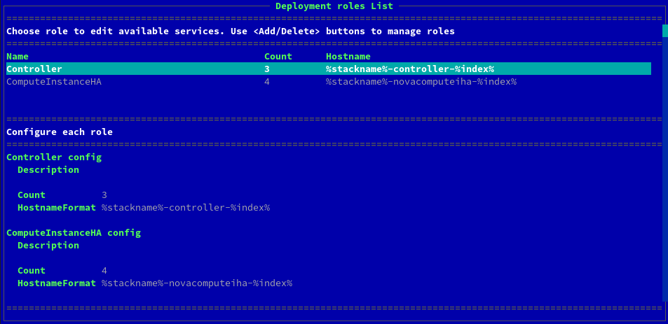
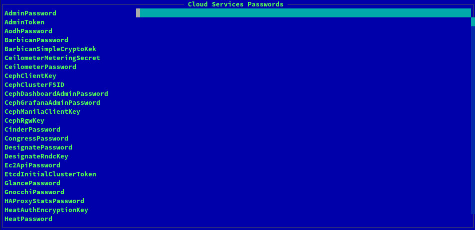
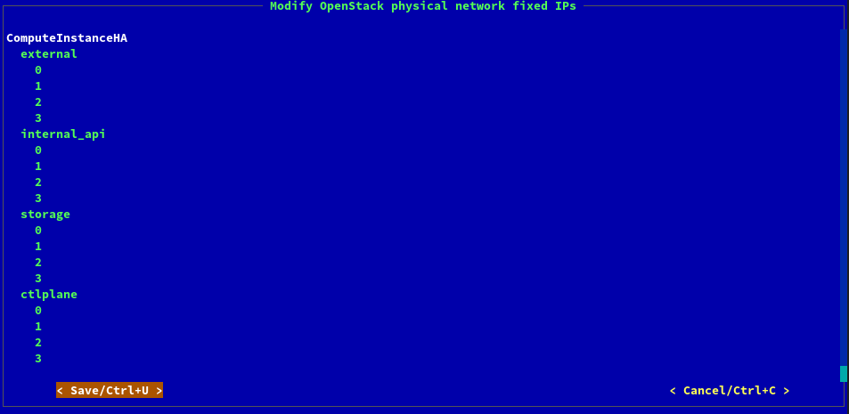

# Подготовка одного развёртывания

В этом разделе описана подготовка одного развёртывания с нуля. 
Обязатель пройдите подготовку к развёртываниям в разделе [Подготовка к развёртываниям](full-deployment-init).

При деплое OpenStack с Ceph необходимо сначала развернуть Ceph!

Выберите одно из развёртываний в секции _Deployments_.

На экране отображается **Меню развёртывания**, в котором все настройки влияют только на выбранное развёртывание. 

## Роли, Сервисы и Сети ролей 

Перейдите во вкладку _Roles Services and Networks_. 

Сверху отображается сводная таблица настроек для каждой из ролей, участвующих в развёртывании.

Развёртывание типа _OpenStack_ требует обязательные роли:

* **Controller** - узлы контроллеры 
* **ComputeInstanceHA** - узлы виртуализации

Развёртывание типа _Ceph_ требует только роль **Bare**, в которой нет сервисов. 
Так как само развёртывание Ceph системы происходит за пределами консоли при помощи инструмента **ceph-ansible**.

Ниже можно настроить каждую из ролей отдельно:
* _Description_ - описание, ни на что не влияет, кроме удобства использования; 
* _Count_ - число узлов данной роли;
* _Hostname_ - hostname узлов данной роли;

Ниже необходимо определить множество сетей для каждой роли. Сети соответствуют тем, что были созданы ранее.
В секции _Set default network for each role_ выберите сеть, чей IP-адрес шлюза которая будет использоваться как основной шлюз для сети на узле.  

## Сетевые планы

Перейдите во вкладку _Network plans_. 

Определите IP-адреса NTP и DNS серверов. Несколько адресов можно указать через запятую. 

На данном этапе необходимо быть максимально **внимательным!**

Сетевые планы фиксируют число используемых интерфейсов, настройки адресов или DHCP для каждого из интерфейсов, VLAN'ы и на каких интерфейсах настраиваются VLAN'ы. 
Необходимо предварительно определить схему настройки сети для всех узлов одной роли, используя знания о количестве интерфейсов на каждом узле одной роли.

Схема сети определяется через условные обозначения интерфейсов как _nic1_, _nic2_ и т.д. 
Порядок интерфейсов для каждого из узлов задавался ранее в разделе _Network interfaces order_. 

Если сетей для роли больше чем число используемых интерфейсов, зафиксированное для данной роли, то использование VLAN неизбежно.
В этом случае для настройки VLAN в развёртываниях типа Ceph используются VLAN ядра Linux, в развёртываниях типа OpenStack используется OVS бридж. 

После определения сетевого плана - выйдете из консоли и зайдите в папку шаблонов вашего развёртывания. 
~~~shell
cd /etc/asperitas/templates/<deployment-name>-heat-templates/
~~~

Исследуйте заранее спроектированные планы, которые лежат в папках _ispras-extra/network/config/_ и _network/config_. 
Указанные в шаблонах планы являются настройками инструмента [os-net-config](https://docs.openstack.org/os-net-config/). 
Для детального понимания используйте [документацию инструмента](https://docs.openstack.org/os-net-config/latest/config.html)

Выберите один из заданных сетевых планов или создайте новый в папке 
~~~shell
/etc/asperitas/templates/<deployment-name>-heat-templates/ispras-extra/network/config
~~~

Звтем вернитесь в asperitas консоль в окно _Network plans_ и выберете для каждой роли свой сетефой план.

Виртуальные IP-адреса используются в _OpenStack_ для балансировки нагрузки на узлы управления в облаке. 
Если развёртывание типа **Ceph**, то оставьте все галочки пустыми в секции с виртуальными адресами. 
Если развёртывание типа **OpenStack**, то поставьте галочки для сетей _External_, _InternalApi_ и опционально для других сетей.

## Пароли 

Перейдите во вкладку _Passwords_.

Это окно имеет смысл только для развёртываний типа OpenStack. При развёртывании Ceph этот этап можно пропустить.

Здесь обратите внимание на поля: 
* _AdminPassword_ - это пароль для пользователя _admin_ в развёртываемом облаке
* _CephClientKey_, _CephClusterFSID_ - значения обязательные для связи сервисов OpenStack с Ceph. 

Остальные пароли можно сгенерить случайным образом.

## Фиксированные IP-адреса

Перейдите во вкладку _Fixed IPs_.

IP-адреса можно зафиксировать для развёртываемых серверов. Также актуально фиксировать виртуальные IP-адреса для API развёртываемого обалка. 

Этот этап опционален.

## Настройки сервисов облака 

Перейдите во вкладку _Service settings_.

Необходимо внимательно пройти по всем пунктам в этом окне, указать только используемые опции. 
Те опции, что используются, необходимо обязательно настроить внутри своими параметрами! 

Все опции, кроме Bonding, имеют смысл только при развёртывании типа _OpenStack_! 
Если вы на этапе развёртывания типа _Ceph_, прочтите ниже описание _Bonding_ и используйте его в случае необходимости. Остальные галочки оставьте пустыми. 

* _CephAnsibleExternal_ - обязателен при использовании Ceph, необходимо настроить все параметры внутри и [подготовить](https://access.redhat.com/documentation/en-us/red_hat_openstack_platform/16.2/html/integrating_an_overcloud_with_an_existing_red_hat_ceph_storage_cluster/assembly-preparing-overcloud-nodes_existing-ceph#proc-configuring-the-existing-ceph-storage-cluster_preparing-overcloud-nodes) Ceph;
* _SwiftExternal_ - использовать Ceph Rgw как бекенд для сервиса [Swift](https://access.redhat.com/documentation/en-us/red_hat_openstack_platform/16.2/html/storage_guide/assembly_configuring-the-object-storage-service_osp-storage-guide)
* _CinderCephBackend_ - использовать Ceph как бекенд для сервиса [Cinder](https://access.redhat.com/documentation/en-us/red_hat_openstack_platform/16.2/html/storage_guide/assembly-configuring-the-block-storage-service_osp-storage-guide)
* _CinderIscsiBackend_ - использовать Iscsi как бекенд для сервиса [Cinder](https://access.redhat.com/documentation/en-us/red_hat_openstack_platform/16.2/html/storage_guide/assembly-configuring-the-block-storage-service_osp-storage-guide)
* _CinderNfsBackend_ - использовать Nfs как бекенд для сервиса [Cinder](https://access.redhat.com/documentation/en-us/red_hat_openstack_platform/16.2/html/storage_guide/assembly-configuring-the-block-storage-service_osp-storage-guide)
* _CustomDomain_ - назначить имя домена для API развёртываемого облака
* _IronicOvercloud_, _IronicInspector_ - добавить в развёртываемое облако сервис [Ironic](https://access.redhat.com/documentation/en-us/red_hat_openstack_platform/16.2/html-single/bare_metal_provisioning/)
* _KeysoneDomainSpecificLdapBackend_, _HorizonDomains_ - использовать готовый LDAP сервер для сервиса [Keysone](https://docs.openstack.org/keystone/latest/admin/configuration.html#integrate-identity-with-ldap).
Для этого вам также понадобится использовать несколько доменов для авторизации в сервисе Horizon.
* _NovaNfsBackend_ - использовать Nfs сервер как бекенд для сервиса [Nova](https://access.redhat.com/documentation/en-us/red_hat_openstack_platform/16.1/html/configuring_the_compute_service_for_instance_creation/assembly_configuring-compute-service-storage_compute-performance)
* _GlanceNfsBackend_ - использовать Nfs сервер как бекенд для сервиса [Glance](https://access.redhat.com/documentation/en-us/red_hat_openstack_platform/16.2/html/advanced_overcloud_customization/assembly_configuring-the-image-import-method-and-shared-staging-area)
* _GlanceCephBackend_ - использовать Ceph сервер как бекенд для сервиса [Glance](https://access.redhat.com/documentation/en-us/red_hat_openstack_platform/16.0/html/overcloud_parameters/image-storage-glance-parameters) 
* _ComputeInstanceHA_, _PacemakerEnabled_ - обязательны для развёртывания типа OpenStack с 3-мя и более контроллерами;
* _Bonding_ - указывается, если использовать агрегацию интерфейсов при развёртывании. 
В развёртываниях типа Ceph значение параметра _BondInterfaceOvsOptions_ должно быть равно _mode=active-backup_, типа OpenStack - _bond_mode=active-backup_. 
Так как в Ceph используется агрегация ядра Linux, в OpenStack - агрегация Ovs.     

При определении бекендов сервисов необходимо учитывать, что для Glance и Nova может быть выбран только один. Для сервиса Cinder может использоваться несколько разных бекендов.
