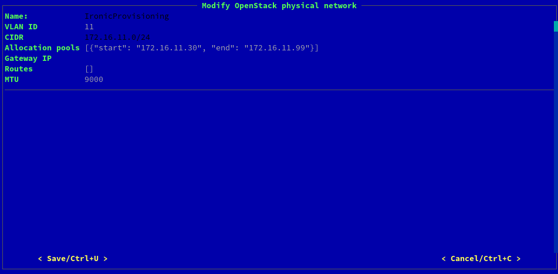
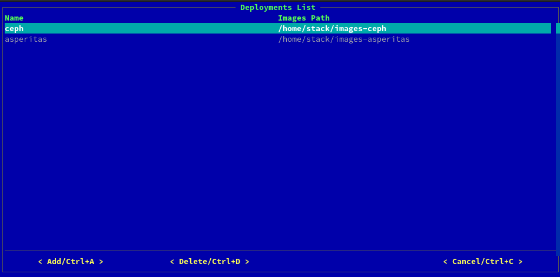
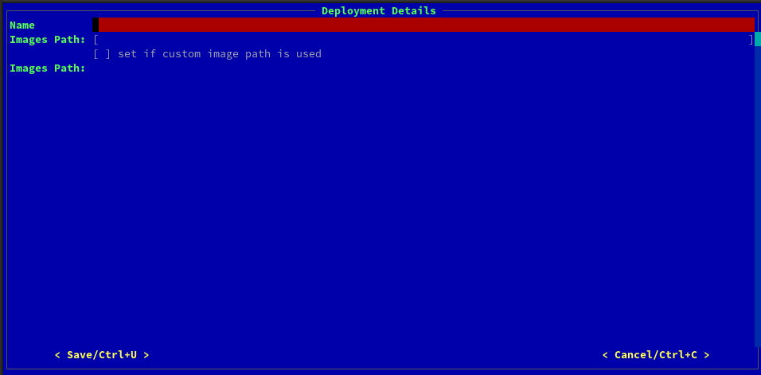
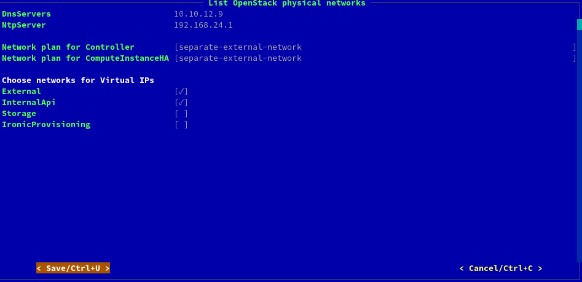

# Полное развёртывание с нуля

При первоначальном развёртывании строго советуется пройти каждый пункт! 
Asperitas Console не предполагает быстрого старта или прототипного развёртывания! 

Для запуска консоли введите команду в консоли узла развёртывания
~~~shell
asperitas
~~~

Для запуска консоли в режиме **debug** используйте команду 
~~~shell
asperitas --debug
~~~

После выполнения команды появляется **Главное окно** asperitas консоли

## Физические узлы 

Перейдите во вкладку _Baremetal nodes_. 
Нажмите кнопку _Add_, чтобы добавить новый физический узел для добавления в развёртываемое облако.

Красным цветом выделены поля обязательные для заполнения.

* _Name_ -  имя физического узла. Используется лишь для удобства, не влияет на hostname узла;
* _BMC type_ - тип BMC, поддерживаемые значения: _IPMI_, _iDRAC_;
* _BMC address_ - IP-адрес BMC, пример: _2.3.4.5_ ;
* _BMC login_ - логин для управления физическим узлом через BMC;
* _BMC password_ - пароль для управления физическим узлом через BMC;
* _Profile_ - роль физического узла в развёртываемом облаке; 
* _UEFI boot mode_ - установите галочку, если узел загружается в режиме UEFI;
* _PXE port mac_address_ - мак адрес физического порта узла, через который происходит загрузке по PXE.

Поля необязательные для заполнения (используются, если интроспекция узла нежелательна):
* _Disk capacity_ - размер физического диска для установки операционной системы;
* _Cpu number_ - число процессорных ядер узла;
* _Architecture_ - архитектура процессора (поддерживается только x86_64);
* _Memory capacity_ - размер оперативной памяти узла.

Нажмите кнопку _Save_. Физический узел добавится в список физических узлов. 
При добавлении физического узла узел не включается и вводится в развёртываемое облако.

Дождитесь изменения статуса узла на _manageable/available_. 
Если узел остаётся в статусе enroll, перейдите в раздел "Исправление проблем". 

Статус _manageable_ позволяет включать и выключать узел из системы на узле развёртывания. 
Статус _available_ позволяет ввести машину в развёртываемое облако. 
Система автоматически переводит узел в состояние _available_, если известны параметры _Disk capacity_, _Cpu number_, _Architecure_ и _Memory capacity_.

## Интроспекция

Перейдите во вкладку _Introspection_ Главного меню. 

На экране отобразится список физических машин, добавленных в предыдущем пункте.

Отметьте весь список машин и нажмите кнопку _Start_. Начнётся интроспекция физических узлов. Статус отображается в правой половине экрана. 

После успешного окончания интроспекции напротив поле _state_ будет равно значению _finished_, а напротив имени узла появится галочка. 

Статус отображается только для одного узла. Чтобы посмотреть статус для другого узла, нажмите на имя узла. 

После успешной интроспекции можно посмотреть собранные данные дважды нажав мышкой на имя узла. Если мышки нет, то при помощи кнопок наведитесь на имя узла и нажмите _Enter_

 
## Порядок физических интерфейсов

_! Опция доступна только после успешной интроспекции_

Перейдите во вкладку _Network interfaces order_. 

На экране отобразится список узлов и их интерфейсов. Порядок интерфейсов важен, так как далее сетевые планы строятся только по номерами интерфейсов, а не их именам. Поэтому определите порядок так, чтобы интерфейсы всех узлов с одним порядковым номером были настроены одинаково на физических коммутаторах в вашей серверной.  

## Диск операционной системы

_! Опция доступна только после успешной интроспекции_

Перейдите во вкладку _Server root disk_. 

Если у какого-либо физического узла несколько дисков, то необходимо указать правильный диск для установки операционной системы. 
Иначе система выберет физический диск случайным образом.  

## Физические порты 

Перейдите во вкладку _Baremetal ports_. 

Здесь отображаются все физические порты известные системе для загрузки по PXE. 
Первоначально создаётся порт указанный при создании физической машины. Затем после интроспекции добавляется порт, по которому произошла загрузка по PXE, 
**если этот порт не совпал с указанным вами при создании**. 

Если это произошло, то необходимо оставить один порт в системе и удалить ненужный! Иначе при развёртывании порт для загрузки будет выбран случайным образом из этих двух.  

## Сети

Перейдите во вкладку _Networks_. 

В системе Asperitas используется принцип разделения сетей на роли. 
Набор заранее заданных сетей, который обязан присутствовать в системе: 

* _Ctlplane_ - сеть администрирования физических узлов в развёртываемом облаке. 
Это единственная сеть, по которой разрешён SSH доступ к физическим узлам облака. 
* _External_ - сеть для доступа к публичному API развёртываемого облака. 
Сеть должна быть доступна для всех пользователей облака. 
* _InternalApi_ - сеть для доступа к приватному API развёртываемого облака. 
Используется сервисами облака для общения друг с другом. 
Не должна быть доступна даже с узла развёртывания. 
* _Storage_ - сеть для доступа сервисов облака к хранилищу: Ceph или Nfs.

Набор заранее заданных опциональных сетей, их можно удалить из системы за ненадобностью:
* _InternalCeph_ - внутренняя сеть для узлов хранения Ceph.
* _IronicProvisioning_ - сеть для захвата физических узлов сервисом Ironic развёртываемого облака. 
Если сервис не используется, то сеть не нужна.  

Можно изменить параметры сети, нажав на сеть в списке сетей двумя кликами мыши или кнопной _Enter_.

Если необходима дополнительная сеть, то можно добавить новую, нажав кнопку _Add_.

Если в поле _Exists_ стоит галочка, то сеть уже создана в системе и её нельзя удалить из списка сетей. 

Сеть создаётся при развёртывании в дальнейшем и удаляется, если удаляется развёртывание. 

## Шаблоны развёртывания 

Перейдите во вкладку _Deployment templates_. 

При чистом старте - таблица будет пустая. Нажмите кнопку _Add_, чтобы добавить новое развёртывание. 

В появившемся окне вы можете выбрать один из заранее заданных типов развёртывания: _OpenStack_ или _Ceph_, или выбрать _No_.

Если OpenStack планируется развернуть **без Ceph**, то создайте единственное развёртывание типа _OpenStack_.

Если OpenStack планируется развернуть **с Ceph**, то создайте сначала развёртывание _Ceph_, затем _OpenStack_

Заполните имя развёртывания в поле _Name_. Имя будет использоваться как часть hostname физических узлов.

В поле _Images Path_ из выпадающего списке выберите образ операционной системы, используемой для развёртывания. 
Как правило для типа _Ceph_ используются образы _images-ceph_, а для типа _OpenStack_ используются образы _images-asperitas_. 
Если ваш путь к образам отличается от тех, что даются на выбор, то поставьте галочку в поле _set if custom image is used_ и укажите путь к образам в поле ниже. 

На данном этапе при создании развёртывания создаются только шаблоны для настройки развёртываемого облака. 
Никаких изменений с физическими машинами не происходит.

На главном экране asperitas консоли в секции _Deployments_ появятся ваши созданные развёртывания для настройки. 

## Развёртывания

При деплое OpenStack с Ceph необходимо сначала развернуть Ceph!

Выберите одно из развёртываний в секции _Deployments_.

На экране отображается **Меню развёртывания**, в котором все настройки влияют только на выбранное развёртывание. 

### Роли, Сервисы и Сети ролей 

Перейдите во вкладку _Roles Services and Networks_.

Сверху отображается сводная таблица настроек для каждой из ролей, участвующих в развёртывании. 

Ниже можно настроить каждую из ролей отдельно:
* _Description_ - описание, ни на что не влияет, кроме удобства использования; 
* _Count_ - число узлов данной роли;
* _Hostname_ - hostname узлов данной роли;

Ниже необходимо определить множество сетей для каждой роли. Сети соответствуют тем, что были созданы ранее.
В секции _Set default network for each role_ выберите сеть, чей IP-адрес шлюза которая будет использоваться как основной шлюз для сети на узле.  

### Сетевые планы

Перейдите во вкладку _Network plans_. 

Определите IP-адреса NTP и DNS серверов. Несколько адресов можно указать через запятую. 

На данном этапе необходимо быть максимально **внимательным!**

Сетевые планы фиксируют число используемых интерфейсов, настройки адресов или DHCP для каждого из интерфейсов, VLAN'ы и на каких интерфейсах настраиваются VLAN'ы. 
Необходимо предварительно определить схему настройки сети для всех узлов одной роли, используя знания о количестве интерфейсов на каждом узле одной роли.

Схема сети определяется через условные обозначения интерфейсов как _nic1_, _nic2_ и т.д. 
Порядок интерфейсов для каждого из узлов задавался ранее в разделе _Network interfaces order_. 

Если сетей для роли больше чем число используемых интерфейсов, зафиксированное для данной роли, то использование VLAN неизбежно.
В этом случае для настройки VLAN в развёртываниях типа Ceph используются VLAN ядра Linux, в развёртываниях типа OpenStack используется OVS бридж. 

После определения сетевого плана - выйдете из консоли и зайдите в папку шаблонов вашего развёртывания. 
~~~shell
cd /etc/asperitas/templates/<deployment-name>-heat-templates/
~~~

Исследуйте заранее спроектированные планы, которые лежат в папках _ispras-extra/network/config/_ и _network/config_. 
Указанные в шаблонах планы являются настройками инструмента [os-net-config](https://docs.openstack.org/os-net-config/). 
Для детального понимания используйте [документацию инструмента](https://docs.openstack.org/os-net-config/latest/config.html)

Выберите один из заданных сетевых планов или создайте новый в папке 
~~~shell
/etc/asperitas/templates/<deployment-name>-heat-templates/ispras-extra/network/config
~~~

Звтем вернитесь в asperitas консоль в окно _Network plans_ и выберете для каждой роли свой сетефой план.

Виртуальные IP-адреса используются в OpenStack для балансировки нагрузки на узлы управления в облаке. 
Если развёртывание типа Ceph, то оставьте все галочки пустыми в секции с виртуальными адресами. 
Если развёртывание типа OpenStack, то поставьте галочки для сетей _External_, _InternalApi_ и опционально для других сетей.

### Пароли 

Перейдите во вкладку _Passwords_.

Это окно имеет смысл только для развёртываний типа OpenStack. При развёртывании Ceph этот этап можно пропустить.

Здесь обратите внимание на поля: 
* _AdminPassword_ - это пароль для пользователя _admin_ в развёртываемом облаке
* _CephClientKey_, _CephClusterFSID_ - значения обязательные для связи сервисов OpenStack с Ceph. 

Остальные пароли можно сгенерить случайным образом.

### Фиксированные IP-адреса

Перейдите во вкладку _Fixed IPs_.

IP-адреса можно зафиксировать для развёртываемых серверов. Также актуально фиксировать виртуальные IP-адреса для API развёртываемого обалка. 

Этот этап опционален.

### Настройки сервисов облака 

Перейдите во вкладку _Service settings_.

Необходимо внимательно пройти по всем пунктам в этом окне, указать только используемые опции. 
Те опции, что используются, необходимо обязательно настроить внутри своими параметрами! 

* _CephAnsibleExternal_ - обязателен при использовании Ceph, необходимо настроить все параметры внутри и [подготовить](https://access.redhat.com/documentation/en-us/red_hat_openstack_platform/16.2/html/integrating_an_overcloud_with_an_existing_red_hat_ceph_storage_cluster/assembly-preparing-overcloud-nodes_existing-ceph#proc-configuring-the-existing-ceph-storage-cluster_preparing-overcloud-nodes) Ceph;
* _SwiftExternal_ - использовать Ceph Rgw как бекенд для сервиса [Swift](https://access.redhat.com/documentation/en-us/red_hat_openstack_platform/16.2/html/storage_guide/assembly_configuring-the-object-storage-service_osp-storage-guide)
* _CinderCephBackend_ - использовать Ceph как бекенд для сервиса [Cinder](https://access.redhat.com/documentation/en-us/red_hat_openstack_platform/16.2/html/storage_guide/assembly-configuring-the-block-storage-service_osp-storage-guide)
* _CinderIscsiBackend_ - использовать Iscsi как бекенд для сервиса [Cinder](https://access.redhat.com/documentation/en-us/red_hat_openstack_platform/16.2/html/storage_guide/assembly-configuring-the-block-storage-service_osp-storage-guide)
* _CinderNfsBackend_ - использовать Nfs как бекенд для сервиса [Cinder](https://access.redhat.com/documentation/en-us/red_hat_openstack_platform/16.2/html/storage_guide/assembly-configuring-the-block-storage-service_osp-storage-guide)
* _CustomDomain_ - назначить имя домена для API развёртываемого облака
* _IronicOvercloud_, _IronicInspector_ - добавить в развёртываемое облако сервис [Ironic](https://access.redhat.com/documentation/en-us/red_hat_openstack_platform/16.2/html-single/bare_metal_provisioning/)
* _KeysoneDomainSpecificLdapBackend_, _HorizonDomains_ - использовать готовый LDAP сервер для сервиса [Keysone](https://docs.openstack.org/keystone/latest/admin/configuration.html#integrate-identity-with-ldap).
Для этого вам также понадобится использовать несколько доменов для авторизации в сервисе Horizon.
* _NovaNfsBackend_ - использовать Nfs сервер как бекенд для сервиса [Nova](https://access.redhat.com/documentation/en-us/red_hat_openstack_platform/16.1/html/configuring_the_compute_service_for_instance_creation/assembly_configuring-compute-service-storage_compute-performance)
* _GlanceNfsBackend_ - использовать Nfs сервер как бекенд для сервиса [Glance](https://access.redhat.com/documentation/en-us/red_hat_openstack_platform/16.2/html/advanced_overcloud_customization/assembly_configuring-the-image-import-method-and-shared-staging-area)
* _GlanceCephBackend_ - использовать Ceph сервер как бекенд для сервиса [Glance](https://access.redhat.com/documentation/en-us/red_hat_openstack_platform/16.0/html/overcloud_parameters/image-storage-glance-parameters) 
* _ComputeInstanceHA_, _PacemakerEnabled_ - обязательны для развёртывания типа OpenStack с 3-мя и более контроллерами;
* _Bonding_ - указывается, если использовать агрегацию интерфейсов при развёртывании. 
В развёртываниях типа Ceph значение параметра _BondInterfaceOvsOptions_ должно быть равно _mode=active-backup_, типа OpenStack - _bond_mode=active-backup_. 
Так как в Ceph используется агрегация ядра Linux, в OpenStack - агрегация Ovs.     

При определении бекендов сервисов необходимо учитывать, что для Glance и Nova может быть выбран только один. Для сервиса Cinder может использоваться несколько разных бекендов.

### Развёртывание

Перейдите во вкладку _Deployment_.

Сверху отображается статус развёртывания. Развёртывание состоит из нескольких стадий:
* _**Create/Update Plan Deployment (Install OS)**_, или _Создание стека_ (термин OpenStack Heat) - при этом фиксируются и сохраняются все ваши настройки. 
А также захватываются узлы из списка физических узлов и на них накатывается операционная система.
* _**Run Cloud Service Deployment**_, или Распространение настроек на узлы, настройка сети и развёртывание сервисов на узлах

Также в этом окне отображаются дополнительные действия 
* _Update Known Hosts_ - добавление всех созданных серверов в список известных хостов. 
* _Save generated /etc/hosts_ - сохранить сгенерённый при деплое /etc/hosts в /etc/asperitas/hosts-<deployment-name>. Это необходимо так как при запуске разных развёртываний /etc/hosts перезаписываются. 

Также можно использовать _Debug_ режим, при котором команда для запуска развёртывания не выполняется, а сохраняется в _/etc/asperitas/deploy.sh_.
