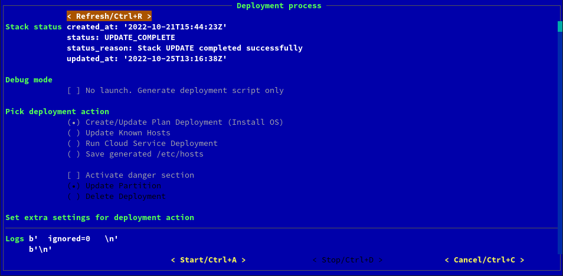
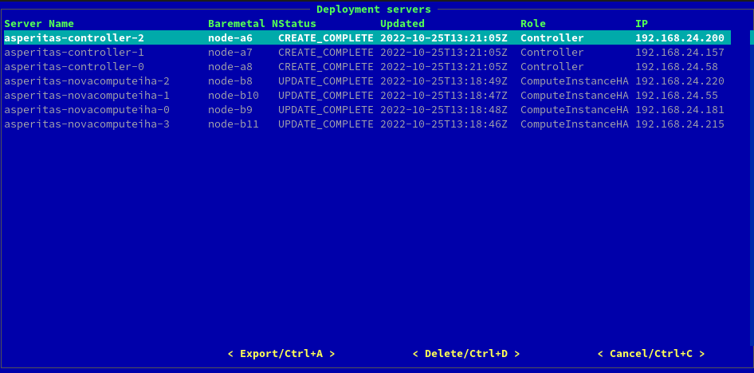
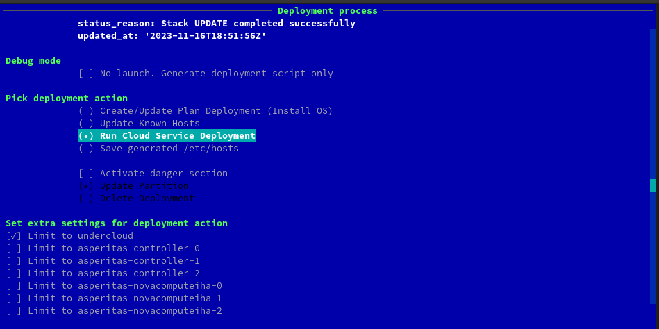

# Развёртывание облака 

Зайдите в asperitas-console 
~~~shell
asperitas
~~~

Перейдите в _Меню развёртывания_, затем во вкладку _Deployment_.

Сверху отображается статус развёртывания. Развёртывание состоит из нескольких стадий:
* _**Create/Update Plan Deployment (Install OS)**_, или _Создание стека_ (термин OpenStack Heat) - при этом фиксируются и сохраняются все ваши настройки. 
А также захватываются узлы из списка физических узлов и на них накатывается операционная система.
* _**Run Cloud Service Deployment**_, или _Распространение настроек на узлы_, настройка сети и развёртывание сервисов на узлах. 
На этой стадии можно выбрать не полное, а [Частичное развёртывание](#частичное-развёртывание). 

Также в этом окне отображаются дополнительные действия 
* _Update Known Hosts_ - добавление всех созданных серверов в список известных хостов. 
* _Save generated /etc/hosts_ - сохранить сгенерённый при деплое /etc/hosts в /etc/asperitas/hosts-<deployment-name>. Это необходимо так как при запуске разных развёртываний /etc/hosts перезаписываются. 

Также можно использовать _Debug_ режим, при котором команда для запуска развёртывания не выполняется, а сохраняется в _/etc/asperitas/deploy.sh_.

На этапе _Create/Update Plan Deployment (Install OS)_ создаются в системе узла развёртывания сервера, которые соответствуют добавленным вами физическим узлам. 
Они имеют другие названия, как правило это _<stack_name>-<role_name>-<number>_. 
Для каждого физического узла может быть создан только один сервер. 

После создания сервера статус физического узла меняется с _available_ на _active_ в списке физических серверов.
Посмотреть список серверов можно из _Главного меню_ или _Меню развёртывания_ в окне **Deployed Servers** или **Servers list** соответственно.  

## Нулевое развёртывание

**Нулевое развёртывание** означает, что _Stack status_ для данного развёртывания отображает пустые значения для всех параметров. 

В этом случае необходимо запустить по порядку все _Deployment actions_ на экране по порядку, дождавшись окончания предыдудщего.
То есть вы запускаете _Create/Update Plan Deployment (Install OS)_, дожидаетесь успешного окончания развёртывания и переходите к следующему _Update Known Hosts_. 

В случае любых проблем и ошибок на каждом этапе необходимо исправить ошибки и запустить развёртывание заново.
Ни один из этапов не может быть пропущен!

## Обновление параметров развёртывания 

Этот пункт вам подходит, если вы изменили: 

* порядок интерфейсов для узла, участвующего в этом развёртывании
* диск операционной системы для узла, участвующего в этом развёртывании 
* параметры сети
* параметры сети для роли 
* состав сервисов для роли
* сетевой план для роли
* пароли для сервисов 
* фиксированные IP-адреса
* настройки опций для сервисов 

В этом случае необходимо сначала обновить изменённые параметры в системе узла развёртывания. 

Для этого пройдите первый этап _Create/Update Plan Deployment (Install OS)_, затем перейдите к этапу _Run Cloud Service Deployment_ и выполните его.

Удалять уже развёрнутые сети таким образом нельзя!

## Добавление узлов в облако

Для добавления новых узлов необходимо пройти пункты из _Подготовка развёртывания с нуля_, касающиеся физических машин:

* Физические узлы 
* Интроспекция
* Порядок физических интерфейсов
* Диск операционной системы
* Физические порты

Затем в _Меню развёртывания_ в окне _Role Services and Networks_ увеличьте число узлов одной из ролей и перейти к стадии развёртывания. 

На стадии развёртывания сначала добавьте новый сервер, выполнив _Create/Update Plan Deployment (Install OS)_.

При успешном добавлении сервера, выполните _Update Known Hosts_. 

Далее выберите _Run Cloud Service Deployment_ и поставьте галочки в дополнительных параметрах снизу в полях: _undercloud_, _<stack-name>-controller-0_ и новые добавленные сервера. Затем нажмите _Start_. 
Таким образом добавление узла будет происходить быстрее. 

## Удаление развёрнутых узлов из облака

При уменьшении количества узлов облака имеются ограничения: удалить можно только узлы с наибольшим индексом.
Индекс узла соответствует суффиксу имени узла. 
Например: _asperitas-controller**-0**_, или _asperitas-novacomputeiha**-7**_, индекс выделен.

Для этого досточно в разделе _Role Services and Networks_ уменьшить количество узлов до необходимого. 
Затем в разделе _Deployment_ запустить действие _Create/Update Plan Deployment (Install OS)_ и _Update Known Hosts_.

## Замена развёрнутых узлов в облаке

Для замены узла необходимо сначала добавить новый физический узел и настроить его согласно инструкции из _Добавление узлов в облако_.

Затем зайдите в окно _Servers list_ в _Меню развёртывания_ и выберете сервер для удаления. 

Важно! Удалить сервер именно из списка в _Меню развёртывания_, а **не** в _Главном меню_.

Затем освободившийся физический узел можно удалить из списка _Baremetal nodes_ в _Главном меню_. 

Дальнейшие действия соответствуют пункту _Добавление узлов в облако_.

## Частичное развёртывание

На стадии **Run Cloud Service Deployment** обновляется окно выбора c опциями _Limit to_:

