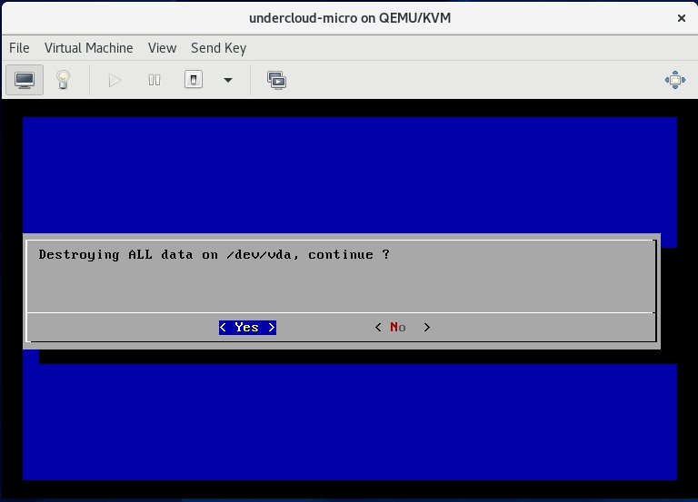
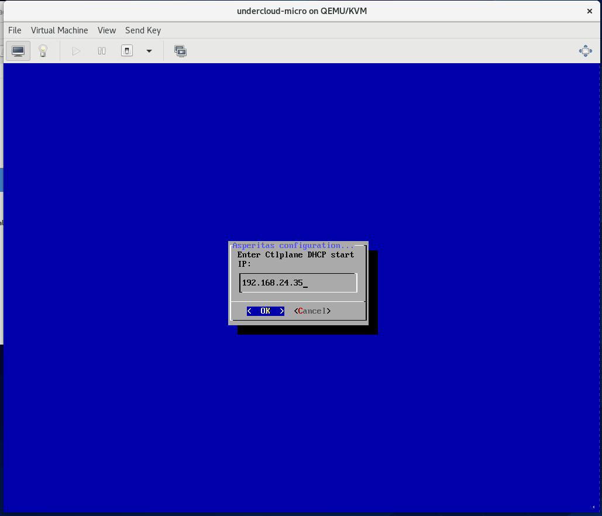
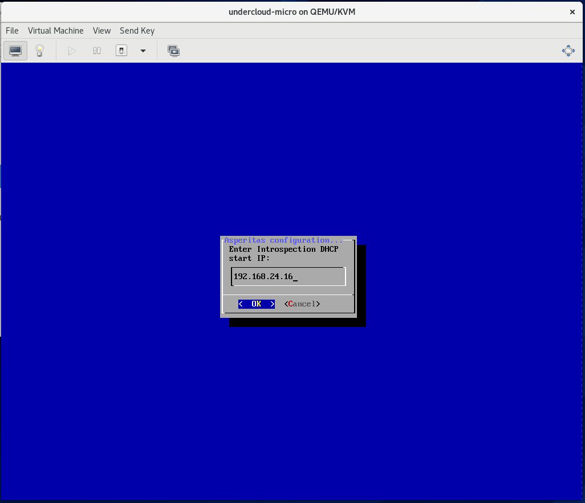
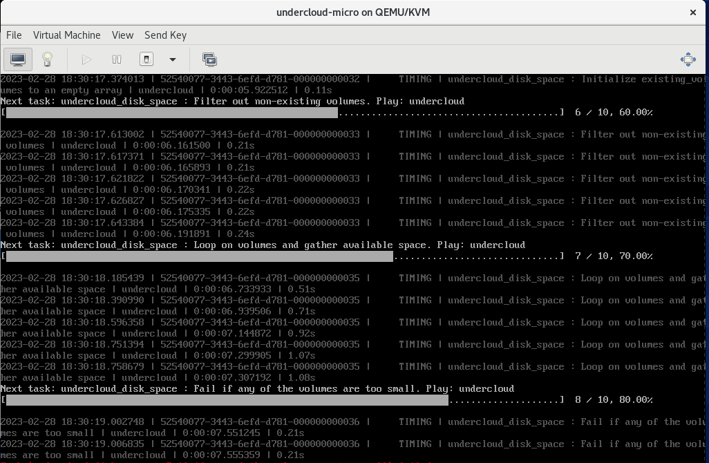

# Установка узла развёртывания

Перед установкой узла развёртывания обязательно проверьте, что вы удовлетворяете требованиям в разделе _Требования к оборудованию и ПО_.

Дистрибутив распространяется на переносимом цифровом носителе, на котором располагается файл undercloud.iso или установщик для образа узла развёртывания. 

* При установке узла на физический узел - вставьте флешку с установщиком в компьютер и загрузитесь в неё с физического узла. 
* При установке на физический узел через BMC по сети Интернет - примонтируйте файл _undercloud.iso_ через виртуальную консоль BMC и загрузитесь в Virtual CD узла. 
* При установке узла развёртывания в виртуальной машине следуйте инструкциям из [приложения](../undercloud-vm)

Далее узел развёртывания иногда может упоминаться как **Undercloud** - это аналогичное название на английском языке.  

## Подготовка к установке 

Перед установкой узла развёртывания необходимо заранее продумать следующие пункты. 

**Сетевая топология**. Узел развёртывания обязан иметь два интерфейса - один для доступа к узлу по ssh разработчиками 
и один для основной **сети развёртывания/ctlplane**.  Для сети развёртывания необходимо знать следующее: 
* **CIDR сети** - по умолчанию 192.168.24.0/24
* **3 IP-адреса** из этой сети для узла развёртывания - по умолчанию 192.168.24.1-.3
* Два пула адресов из этой сети для двух различных DHCP серверов, которые будут подняты на узле развёртывания. Это означает следующее
  * В этой сети не должно существовать **DHCP серверов**
  * Первый пулл адресов **Ctlplane DHCP** должен содержать столько IP-адресов, сколько будет возможный максимум всех физических узлов, используемых в развёртывании, и ещё два. То есть если в системе предполагает 3 контроллера, 50 узлов виртуализации и 50 узлов хранения данных - то в пулле должно быть не менее 105 IP-адресов.
  * Второй пулл адресов **Introspection DHCP** должен содержать столько IP-адресов, сколько будет возможный максимум одновременно интроспектируемых узлов - это может быть небольшое число и как правило 10 адресов достаточно. 
  * Второй пулл адресов **Introspection DHCP** не должен пересекаться с первым пуллом

Дополнительные условия для узла развёртывания - с узла развёртывания должны быть доступны используемые в развёртывании **DNS сервера**, **NTP сервера** и **BMC адреса** для всех физических узлов. 
Также это значит, что заранее должны быть продуманы DNS и NTP сервера организации. 

## Процесс установки 

После загрузки с диска установки вы увидите на экране сервера выбор диска для установки операционной системы AsperitOS. 

Дождитесь загрузки и проверки _undercloud.raw_. 

Затем выберите интерфейс для сети администрирования физических узлов. 
Интерфейс не должен использоваться для доступа к узлу разёртывания!  

На картинке вы видете два интерфейса. 
Предварительно на них был запущен автоматически DHCP клиент.
Первый интерфейс используется как сеть администрирования, поэтому в сети не было DHCP сервера. 
Второй интерфейс используется для доступа к узлу развёртывания. В этой сети есть DHCP сервер, который выдал адрес узлу развёртывания.

Затем введите CIDR для сети администрирования. Важно! После установки сеть будет поменять очень сложно. Поэтому заранее продумайте сети вашей системы!

Введите локальный (основной) IP-адрес узла развёртывания. 
Узел развёртывания имеет 3(!) адреса так как сам является отдельной облачной средой на базе OpenStack. 
3 адреса необходимы для 3 точек доступа к облачным сервисам узла развёртывания: публичной, внутренней точки доступа и точки администратора. 
Локальный IP-адреса считается как внутрення точка доступа в системе.

Введите IP-адрес шлюза для сети администрирования. По умолчанию - это локальный IP-адрес узла развёртывания. 
Но можно указать и другой адрес для вашей сети администрирования.

В сети администрирования узел развёртывания запускает DHCP сервер для раздачи адресов физическим узлам облака. 
Это обязательно, поэтому в этой сети не может быть внешнего другого DHCP сервера во избежание проблем. 
Введите начало и конец множества IP-адресов, которые будут назначены вашим физическим машинам. 
Учтите, что в этой сети заранее заняты 4 адреса для узла развёртывания: 3 указываются вручную, 1 выбирается случайным образом (как правило .5 адрес). 
А также дальше необходимо будет указать ещё одно множество для адресов интроспектирования физических узлов.  

В сети администрирования узел развёртывания запускает ещё один DHCP сервер, который используется для интроспекции физических узлов. 
Множество указанных вами IP-адресов влияет только на количество одновременно интроспектируемых узлов. 
Эти адреса назначаются узлам временно и не сохраняются в дальнейшем. 

Введите публичный IP-адрес для узла развёртывания. Используется для доступа к API облачных сервисов на узле развёртывания. 

Введите IP-адрес для точки доступа администратора на узле развёртывания. 

Введите DNS сервер(а) для узла развёртывания. Если несколько, то перечислите их через запятую. 

Введите NTP сервер(а) для узла развёртывания. Если несколько, то перечислите их через запятую. 

Дождитесь установки облачной системы на базе OpenStack на узел развёртывания. 

Ваш узел развёртывания готов!